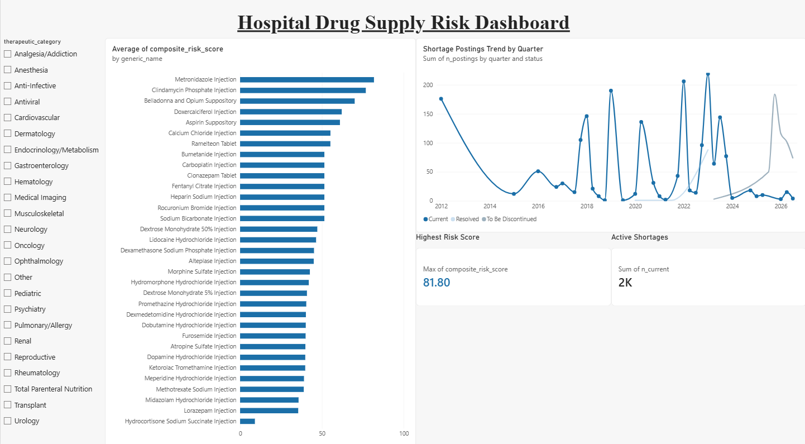

# Hospital Drug Supply Risk & Inventory Planner

A data pipeline and Power BI dashboard that scores which hospital drugs and
therapeutic categories are at the highest risk of a supply disruption, and
recommends safety stock / reorder points, built entirely on **real public
data** (no synthetic or demo placeholders in the final pipeline).



## What it does

Hospitals usually find out about a drug shortage after it has already
started affecting care. This project combines real FDA shortage data, real
CDC seasonal illness surveillance, and real de-identified hospital
prescription data into a single composite risk score per drug, so that
high-risk items can be flagged before they run out.

## Data sources (all real, no synthetic data)

| Source | What | Volume |
|---|---|---|
| [openFDA Drug Shortages](https://open.fda.gov/apis/drug/shortages/) | Active/resolved/discontinuing shortage records | 1,581 records, 24 therapeutic categories |
| [CDC RESP-NET](https://www.cdc.gov/surveillance/respnet/) | Seasonal respiratory illness surveillance | 59,525 rows, 4 networks, 2018–2026 |
| [FDA NDC Directory](https://www.fda.gov/drugs/drug-approvals-and-databases/national-drug-code-directory) | Backfills proprietary drug names | 1,676 rows, 1,369/1,581 shortages matched |
| [MIMIC-IV Clinical Database Demo](https://physionet.org/content/mimic-iv-demo/2.2/) (PhysioNet, MIT/Beth Israel Deaconess) | Real per-drug hospital demand | 71 drug-week demand rows from 1,374/18,087 matched prescriptions |

## Pipeline

```
openFDA + CDC + NDC + MIMIC-IV
        │
        ▼
   DuckDB  (src/build_*.py)
        │
        ▼
 Risk model  (src/risk_model.py)
   composite risk score, safety stock, reorder point
        │
        ▼
 reports/powerbi_export.xlsx
        │
        ▼
   Power BI dashboard  (reports/hospital_drug_supply_dashboard.pbix)
```

## Key findings

- **Metronidazole Injection** ranks highest (risk score 81.8) — active
  shortage compounded by Anti-Infective seasonal amplification.
- **Clindamycin Phosphate Injection** follows at 76.8, same driver.
- A cluster of **"To Be Discontinued"** drugs (Belladonna and Opium
  Suppository, Lidocaine HCl Injection, Doxercalciferol Injection) score
  high on discontinuation risk even at low volume — a signal a purely
  volume-based model would miss.

Full write-up: [`docs/case_study.docx`](docs/case_study.docx)

## Tech stack

Python (pandas, duckdb) · DuckDB · SQL · Power BI Desktop

## Quickstart

```bash
python -m venv venv && source venv/bin/activate
pip install -r requirements.txt

python src/fetch_shortages.py && python src/build_database.py
python src/fetch_seasonal.py  && python src/build_seasonal.py
python src/fetch_ndc.py       && python src/build_ndc.py
python src/build_demand_from_mimic.py --prescriptions data/raw/mimic_demo/.../prescriptions.csv.gz
python src/risk_model.py
python src/explore.py   # exports reports/powerbi_export.xlsx
```

Open `reports/hospital_drug_supply_dashboard.pbix` in Power BI Desktop to
view the dashboard.

## Project structure

```
src/        pipeline scripts (fetch, build, risk model)
sql/        exploratory SQL views
tests/      unit tests (pytest)
fixtures/   small real-data samples used in tests
reports/    exported CSVs, powerbi_export.xlsx, the .pbix dashboard
docs/       full case study write-up + development log (bug fixes, schema notes)
```

## Status

All 5 project steps complete — data pipeline, risk model, Power BI
dashboard, and write-up. See [`docs/DEVLOG.md`](docs/DEVLOG.md) for the full
build log, including two real correctness bugs found and fixed against live
API data.

## Notes

Full credentialed MIMIC-IV access (364,627 patients vs. the demo's 100) is
pending approval through PhysioNet; the demand pipeline swaps in the full
dataset with no code changes once granted.
